# **Industria Musical**

## Validación de hipótesis para el éxito de una canción.

### Temas

- [Introducción](#introducción)
- [Herramientas](#herramientas)
- [Procesamiento](#procesamiento)
- [Validación de hipótesis](#validación-de-hipótesis)
- [Conclusiónes](#Conclusiónes)
- [Recomendaciones](#Recomendaciones)
- [Recursos](#Recursos)

## Introducción
En un mundo en el que la industria musical es extremadamente competitiva y está en permanente evolución, la capacidad de tomar decisiones basadas en datos se ha convertido en un activo invaluable. En este contexto, una discográfica se enfrenta al emocionante desafío de lanzar un nuevo artista en el escenario musical global. Afortunadamente, cuenta con una herramienta poderosa en su arsenal: un extenso dataset de Spotify con información sobre las canciones más escuchadas en 2023. La discográfica planteó una serie de hipótesis sobre qué hace que una canción sea más escuchada, las que deberán ser analizadas para asegurar un lanzamiento exitoso.

### Trabajo en dupla
- [Verónica Domínguez](https://github.com/VeronicaDomR)
- [Alejandra Martínez](https://github.com/Al3jandraMtz)

### **Herramientas**
  + SQL
  + BigQuery
  + PowerBI
  + Python

## **Procesamiento**

  ### **1.1 Limpieza de Datos**

  1.- Importación de 3 data set a BigQuery: Se creó el proyecto en BigQuery con nombre Proyecto_Spotify, una vez creado el proyecto se realiza la importación de las tablas:
  
  + track_in_competition
  + track_in_spotify. Se modifico el archivo en artist(s), se quitan los parentesis para poderlo subir.
  + track_technical_info
    
  2.- Identificar y manejar valores nulos: Se identificaron nulos a través de comandos SQL
  
  + track_in_competition
    + Track_id : 0 null
    + in_apple_charts : 0 null
    + in_apple_playlists: 0 nulls
    + in_deezer_playlists: 0 nulls
    + in_deezer_charts: 0 nulls
    + in_shazam_charts: 50 nulls
  + track_in_spotify
    + track_in_spotify: 0 nulls
    + track_name: 0 nulls
    + artists_name: 0 nulls
    + artist_count: 0 nulls
    + released_year: 0 nulls
    + released_month: 0 nulls
    + released_day : 0 nulls
    + in_spotify_playlists: 0 nulls
    + in_spotify_playlists: 0 nulls
    + streams: 0 nulls

    Query:
    ~~~
     SELECT
    COUNT (*)
    FROM
      `proyecto-1-spotify.Data_set.track_in_competition`
    WHERE in_shazam_charts IS NULL
     
    ~~~

  + track_technical_info
    + track_id: 0 nulls
    + bpm: 0 null
    + key: 95 nulls
    + mode: 0 nulls
    + danceability_%: o nulls
    + valence_%: 0 nulls
    + energy_%: 0 null
    + acousticness_%: 0 null
    + instrumentalness_%: 0 null
    + liveness_%: 0 null
    + speechiness_%: 0 null

    Query (Buscar en todas las columnas)
    ~~~
    SELECT
    COUNT (*)
    FROM
      `proyecto-1-spotify.Data_set.track_technical_info`
    WHERE
    track_id IS NULL
    OR bpm IS NULL
    OR key IS NULL
    OR mode IS NULL
    OR 'danceability_%' IS NULL
    OR "valence_%" IS NULL
    or "energy_%" IS NULL
    OR "acousticness_%" IS NULL
    OR "instrumentalness_%" IS NULL
    OR "liveness_%" IS NULL
    OR "speechiness_%" IS NULL
     
    ~~~

    Query (Obtención de nulos en la nueva columna)
    ~~~
    SELECT
      COUNTIF(track_id IS NULL) AS track_id_nulos,
      COUNTIF(track_name IS NULL) AS track_name_nulos,
      COUNTIF(artists_name IS NULL) AS artists_name_nulos,
      COUNTIF(artist_count IS NULL) AS artist_count_nulos,
      COUNTIF(released_month IS NULL) AS released_month_nulos,
      COUNTIF(released_day IS NULL) AS released_day_nulos,
      COUNTIF(in_spotify_playlists IS NULL) AS in_spotify_playlists_nulos,
      COUNTIF(streams IS NULL) streams_nulos,
    FROM
     
    ~~~

  3.- Identificar Duplicados: Se han identificado duplicados a través de comandos SQL
  
  + track_in_competition: Sin duplicados
  + tranck_in_spotiffy: Presenta Duplicados
  + track_technical_info: Sin duplicados
     
  > [!NOTE]
  > RESULTADOS
  > 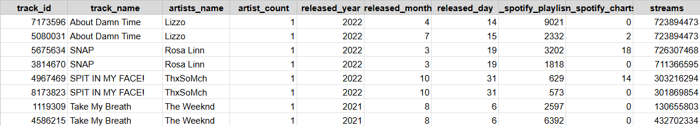

  Query:
  ~~~
    WITH
      duplicados AS (
      SELECT
        track_name,
        artists_name,
        COUNT(*) AS duplicado
      FROM
        `proyecto-1-spotify.Data_set.track_in_spotify`
      GROUP BY
        track_name,
        artists_name
      HAVING
        COUNT(*) > 1 )
    SELECT
      track_name,
      artists_name,
      duplicado
    FROM
      duplicados
  ~~~

  Query basico:
 ~~~
    SELECT
        track_name,
        artists_name,
        COUNT(*) AS duplicado
      FROM
        `proyecto-1-spotify.Data_set.track_in_spotify`
      GROUP BY
        track_name,
        artists_name
      HAVING
        COUNT(*) > 1 
 ~~~

  4.- Eliminar valores fuera del alcance del análisis: Se han manejado datos fuera del alcance a través de comandos SQL.
  
  + track_in_competition: Se considero que necesitariamos todos los datos para analizar las hipotesis solicitadas.
  + track_in_spotify: Se considero que necesitariamos todos los datos para analizar las hipotesis solicitadas.
  + track_in_technical_info: Se llego a al conclusión de que key y mode no serian utiles para el analisis que estamos realizando.

  Query:
   ~~~
    SELECT
    * EXCEPT (key, mode)
    FROM
      `proyecto-1-spotify.Data_set.track_technical_info`
  ~~~

  5.- Identificar y manejar datos discrepantes en variables categóricas: Se han identificado y manejado datos discrepantes (simbolos) en variables numéricas a través de comandos SQL.
  
  + track_in_competition: Sin datos discrepantes
  + track_in_spotify:  Con datos discrepantes
  + track_in_technical_info: Sin datos discrepantes
    
  Nos ayuda a quitar este tipo de simbología ��

  Query:
  ~~~  
  SELECT
  track_name,
  REGEXP_REPLACE(track_name, r'[^a-zA-Z0-9 ]', ' ') AS track_name_limpio
  FROM
    `proyecto-1-spotify.Data_set.track_in_spotify`
  ~~~

  6.- Identificar valores discrepantes en variables numéricas con MAX, MIN y AVG: Se han identificado y manejado datos discrepantes en variables numéricas a través de comandos SQL
  
  + track_in_competition: Sin datos discrepantes
  + track_in_spotify: Con datos discrepantes en streams
  + track_in_technical_info: Sin datos discrepantes

  Utilizamos varias consultas para obtener el resultado deseado:

  Query 1:
  ~~~  
  SELECT
  MAX (streams),
  MIN (streams),
  FROM
    `proyecto-1-spotify.Data_set.track_in_spotify`
  ~~~

  Query 2: (Con Safe cast para convertir STINGS en INTEGER de los streams)
~~~
  SELECT
    MAX(in_spotify_playlists) AS max_in_spotify_playlists,
    MIN(in_spotify_playlists) AS min_in_spotify_playlists,
    AVG(in_spotify_playlists) AS avg_in_spotify_playlists,
    MAX(in_spotify_charts) AS max_spotify_charts,
    MIN(in_spotify_charts) AS min_spotify_charts,
    AVG(in_spotify_charts) AS avg_spotify_charts,
    MAX(SAFE_CAST (streams AS INT64)) AS max_streams,
    MIN(streams) AS min_streams,
    AVG(SAFE_CAST (streams AS INT64)) AS avg_streams,
  FROM
  `proyecto-1-spotify.Data_set.track_in_spotify`
~~~

  Query 3: (Completo)
~~~
  SELECT
    MAX(`bpm`) AS max_bpm,
    MIN(`bpm`) AS min_bpm,
    AVG(`bpm`) AS avg_bpm,
    MAX(`danceability_%`) AS max_danceability,
    MIN(`danceability_%`) AS min_danceability,
    AVG(`danceability_%`) AS avg_danceability,
    MAX(`valence_%`) AS max_valence,
    MIN(`valence_%`) AS min_valence,
    AVG(`valence_%`) AS avg_valence,
    MAX(`energy_%`) AS max_energy,
    MIN(`energy_%`) AS min_energy,
    AVG(`energy_%`) AS avg_energy,
    MAX(`acousticness_%`) AS max_acousticness,
    MIN(`acousticness_%`) AS min_acousticness,
    AVG(`acousticness_%`) AS avg_acousticness,
    MAX(`instrumentalness_%`) AS max_instrumentalness,
    MIN(`instrumentalness_%`) AS min_instrumentalness,
    AVG(`instrumentalness_%`) AS avg_instrumentalness,
    MAX(`liveness_%`) AS max_liveness,
    MIN(`liveness_%`) AS min_liveness,
    AVG(`liveness_%`) AS avg_liveness,
  FROM
   `proyecto-1-spotify.Data_set.track_technical_info`
~~~

  7.- Comprobar y cambiar tipo de dato: Se cambiaron el tipo de dato a través de comandos SQL.
  
  + track_in_competition: No requirio cambios de datos.
  + track_in_spotify:  Con datos tipo STRING en vez de númericos (INTEGER).
  + track_in_technical_info: No requirio cambios de datos.

  Query: (Cambiar el tipo de dato)
~~~
  SELECT
  safe_cast(streams AS INT64) AS streams_limpio
  FROM
    `proyecto-1-spotify.Data_set.track_in_spotify`
~~~

  Query: (Comando para que no aparezca algúna palabra)
~~~
  SELECT
    *
  FROM
    `proyecto-1-spotify.Data_set.track_in_spotify`
    WHERE
    streams NOT LIKE '%BPM%'
~~~

  8.- Crear nuevas variables: Se crearon nuevas variables a través de comandos SQL.
  
  + track_in_competition: Sin nueva variable.
  + track_in_spotify:  Se crea la fecha (aaaa-mm-dd)
  + track_in_technical_info: Sin nueva variable.

  Query: (Concatenar)
~~~
  SELECT
  CONCAT(released_year,"-", released_month,"-", released_day)
  FROM
    `proyecto-1-spotify.Data_set.track_in_spotify`
  LIMIT
    1000
~~~

  Query: (Fecha día/mes a dos cifras)
~~~
  SELECT
    DATE( SAFE_CAST(released_year AS INT64), SAFE_CAST(released_month AS INT64), SAFE_CAST(released_day AS INT64) ) AS release_date 
   FROM
      `proyecto-1-spotify.Data_set.track_in_spotify`
~~~

  9.- Unir tablas
  
  + track_in_competition: La tabla no requirio limpieza de datos.
  + track_in_spotify:  Se crea tabla en views con los datos limpios.

  Query:  (Crear tabla nueva limpia)
~~~
  SELECT
  *,
  REGEXP_REPLACE(track_name, r'[^a-zA-Z0-9 ]', ' ') AS track_name_limpio,
  REGEXP_REPLACE(artists_name, r'[^a-zA-Z0-9 ]', ' ') AS artist_name_limpio,
  safe_cast(streams AS INT64) AS streams_limpio,
  DATE( SAFE_CAST(released_year AS INT64), SAFE_CAST(released_month AS INT64), SAFE_CAST(released_day AS INT64) ) AS release_date 
  FROM
    `proyecto-1-spotify.Data_set.track_in_spotify`
  
  WHERE
  streams NOT LIKE '%BPM%'
~~~

   + track_in_technical_info:  Se crea tabla en views con los datos limpios.

  Query:  (Crear tabla nueva limpia)
~~~
  SELECT
  *
  EXCEPT (key, mode)
  FROM
    `proyecto-1-spotify.Data_set.track_technical_info'
~~~

  Para la unión de las  3 tablas usamos:

  Query:
~~~
  SELECT
    *
  FROM
    `proyecto-1-spotify.Data_set.Track_in_Spotify_limpio` AS TS
  LEFT JOIN
    `proyecto-1-spotify.Data_set.Track_in_competition_limpio` AS TC
  ON
    TS.track_id = TC.track_id
  LEFT JOIN
    `proyecto-1-spotify.Data_set.track_technical_info_limpio` AS TI
  ON
    TS.track_id = TI.track_id
~~~

  Creación del DATA SET por orden de categorias:

  Query:
~~~
  SELECT
  TS.track_id,
  TS.track_name_limpio,
  TS.artist_name_limpio,
  TS.artist_count,
  TS.released_year,
  TS.released_month,
  TS.released_day,
  TS.release_date,
  TS.in_spotify_playlists,
  TS.in_spotify_charts,
  TS.streams_limpio,
  TC.in_apple_playlists,
  TC.in_apple_charts,
  TC.in_deezer_playlists,
  TC.in_deezer_charts,
  TC.in_shazam_charts,
  TI.bpm,
  TI.`danceability_%`,
  TI.`valence_%`,
  TI.`energy_%`,
  TI.`acousticness_%`,
  TI.`instrumentalness_%`,
  TI.`liveness_%`,
  TI.`speechiness_%`
  
  FROM
    `proyecto-1-spotify.Data_set.Track_in_Spotify_limpio` AS TS
  LEFT JOIN
    `proyecto-1-spotify.Data_set.Track_in_competition_limpio` AS TC
  ON
    TS.track_id = TC.track_id
  LEFT JOIN
    `proyecto-1-spotify.Data_set.track_technical_info_limpio` AS TI
  ON
    TS.track_id = TI.track_id
~~~

  10.- Construir tablas auxiliares: Se ha utilizado la estructura de tablas temporales WITH para crear una tabla temporal para total de canciones por artista y veces que una canción se repite en un       playlist.

  Query:  (Canciones por artista)
~~~
  with canciones_por_artista AS (
    SELECT 
    artist_name_limpio,
    count(track_id) as total_canciones
     FROM `proyecto-1-spotify.Data_set.Data_set_completo2`
     group by
     artist_name_limpio
  )
  select
  *
  from
  canciones_por_artista
~~~

  Query: (Veces que aparece una cancion en playlist)
~~~
  WITH
    participacion_en_playlists AS (
    SELECT
      track_name_limpio,
      SUM(in_spotify_playlists) AS total_playlists
    FROM
      `proyectospotify-426316.dataset.track_in_spotify_limpio`
    GROUP BY
      track_name_limpio )
  SELECT
    *
  FROM
    participacion_en_playlists
    ORDER BY total_playlists DESC
~~~

  > [!NOTE]
  > 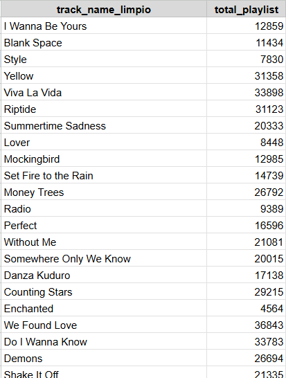

  ## **1.2 Análisis exploratorio**

  1.-Agrupar variables categóricas a través de tablas en Power BI: Se conectó la información desde BigQuery a PowerBI para poder comenzar a trabajar, asi como tambien se realizó una matriz con artista y         número de tracks, así como una de tracks por año.
  
  > [!NOTE]
  > 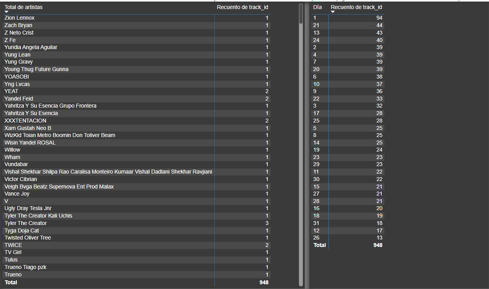
  
  2.- Visualizar las variables categóricas: Se realizaron los gráficos de las matrices anteriores, artista y número de tracks, así como una de tracks por año.
  
  > [!NOTE]
  > 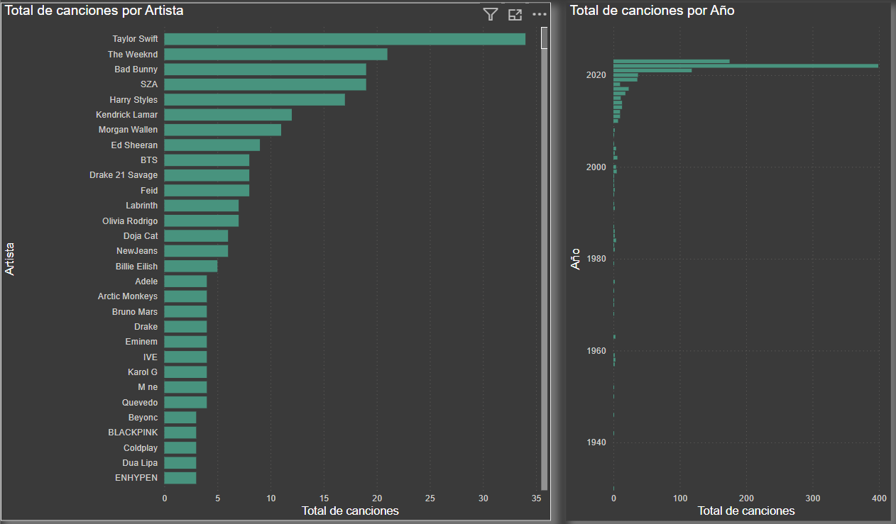
  
  3.- Aplicar medidas de tendencia central y medidas de dispersión.
  
  > [!NOTE]
  > 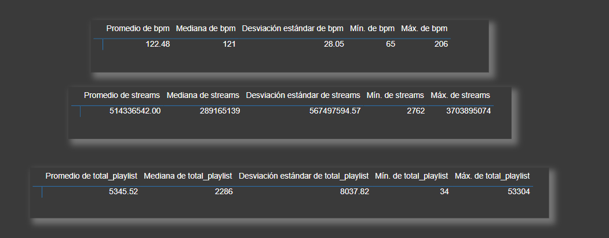
  
  4.- Visualizar distribución: Se crearon dos un Histogramas en PowerBi atravez de Python

  > [!NOTE]
  > 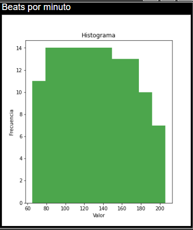

  Interpretación: La gráfica de histograma muestra la distribución de frecuencias de los beats por minuto (BPM) en un conjunto de datos. Los valores en el eje horizontal representan rangos de BPM, y las     barras azules verticales indican cuántas veces ocurren esos BPM dentro del conjunto de datos. Aquí hay algunos puntos clave:
  
  +  Rango de BPM: Los BPM varían aproximadamente entre 75 y 200.
  +  Frecuencia más alta: Hay una mayor concentración de datos en los rangos de BPM más bajos.
  +  Distribución: La frecuencia disminuye a medida que aumenta el BPM, lo que sugiere que hay menos canciones con BPM altos.
    
  Esto podría indicar que las canciones con BPM más lentos son más comunes o preferidas en el conjunto de datos analizado.

  Consulta:
~~~
   # Pegue o escriba aquí el código de script:
  import matplotlib.pyplot as plt
  import pandas as pd
  # Obtén los datos de Power BI
  data = dataset [['bpm']]
  # Crea el histograma
  plt.hist(data, bins=10, color='blue', alpha=0.7)
  plt.xlabel('Valor')
  plt.ylabel('Frecuencia')
  plt.title('Histograma')
  # Muestra el histograma
  plt.show()
~~~

  > [!NOTE]
  > 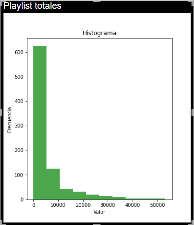

  Interpretación: Muestra la frecuencia de playlists según una variable no especificada en el eje x. La mayoría de las playlists se concentran en el primer intervalo, con más de 500           ocurrencias,   lo que indica que hay una gran cantidad de playlists con valores bajos en esta variable. La frecuencia disminuye drásticamente en los intervalos siguientes, sugiriendo que hay muy pocas playlists con       valores altos.

  Consulta:
~~~
  # El código siguiente, que crea un dataframe y quita las filas duplicadas, siempre se ejecuta y actúa como un preámbulo del script: 
  # dataset = pandas.DataFrame(artist_count, Año)
  # dataset = dataset.drop_duplicates()
  # Pegue o escriba aquí el código de script:
  # Pegue o escriba aquí el código de script:
  import matplotlib.pyplot as plt
  import pandas as pd
  # Obtén los datos de Power BI
  data = dataset [['total_playlist']]
  # Crea el histograma
  plt.hist(data, bins=10, color='blue', alpha=0.7)
  plt.xlabel('Valor')
  plt.ylabel('Frecuencia')
  plt.title('Histograma')
  # Muestra el histograma
  plt.show()
~~~

  5.- Visualizar el comportamiento de los datos a lo largo del tiempo: Se crearon gráficos de líneas para medir el comportamiento de canciones y streams a lo largo del tiempo.

  Gráfica de lanzamiento de canciones por año

  > [!NOTE]
  > 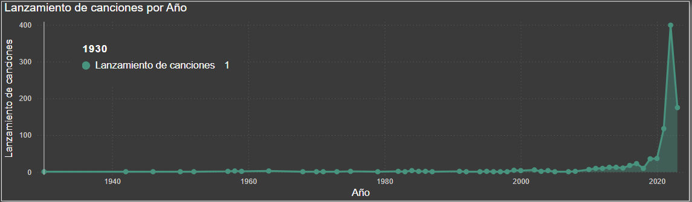
  
  Gráfica de total Streams (veces que se reproduce una canción por año)
  
  > [!NOTE]
  > 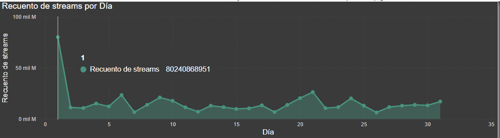
  
  6.- Calcular cuartiles, deciles o percentiles.

  Consulta
~~~
   WITH Quartiles AS (
    SELECT
      streams_limpio,
      `danceability_%`,
      `valence_%`,
      `acousticness_%`,
      `instrumentalness_%`,
      `liveness_%`,
      `speechiness_%`,
     
      NTILE(4) OVER (ORDER BY streams_limpio) AS quartile_streams,
      NTILE(4) OVER (ORDER BY bpm) AS quartile_bpm,
      NTILE(4) OVER (ORDER BY `danceability_%`) AS quartile_danceability,
      NTILE(4) OVER (ORDER BY `valence_%`) AS quartile_valence,
      NTILE(4) OVER (ORDER BY `energy_%`) AS quartile_energy,
      NTILE(4) OVER (ORDER BY `acousticness_%`) AS quartile_acousticness,
      NTILE(4) OVER (ORDER BY `instrumentalness_%`) AS quartile_instrumentalness,
      NTILE(4) OVER (ORDER BY `liveness_%`) AS quartile_liveness,
      NTILE(4) OVER (ORDER BY `speechiness_%`) AS quartile_speechiness
     
    FROM
      `proyectospotify-426316.dataset.dataset_limpio2`
  )
  SELECT
    a.*,
     IF(Quartiles.quartile_streams = 4, "alto", "bajo") AS cat_streams,
    IF(Quartiles.quartile_danceability = 4, "alto", "bajo") AS cat_danceability,
     IF(Quartiles.quartile_valence = 4, "alto", "bajo") AS cat_valence,
      IF(Quartiles.quartile_energy = 4, "alto", "bajo") AS cat_energy,
       IF(Quartiles.quartile_acousticness = 4, "alto", "bajo") AS cat_acousticness,
        IF(Quartiles.quartile_instrumentalness = 4, "alto", "bajo") AS cat_instrumentalness,
         IF(Quartiles.quartile_liveness = 4, "alto", "bajo") AS cat_liveness,
          IF(Quartiles.quartile_speechiness = 4, "alto", "bajo") AS cat_speechiness,
          IF(Quartiles.quartile_bpm = 4, "alto", "bajo") AS cat_bpm
  FROM
    `proyectospotify-426316.dataset.dataset_limpio2` a
  LEFT JOIN
    Quartiles
  ON
    a.streams_limpio = Quartiles.streams_limpio
    AND a.`danceability_%` = Quartiles.`danceability_%`
~~~

  > [!NOTE]
  > 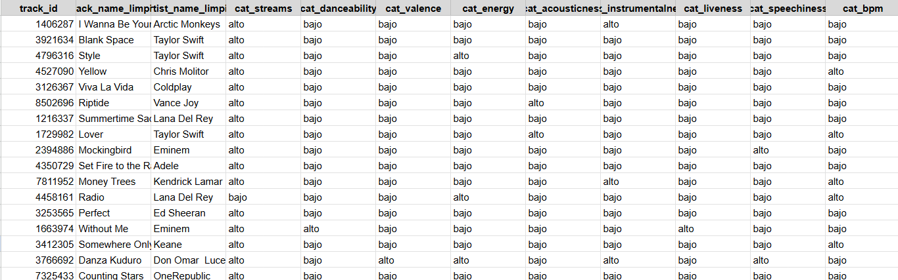
  
  7.- Calcular correlación entre variables: En esta tabla se puede observar la relación de dos variables, mismas que ayudan a refutar y/o confirmar las hipótesis.

  1.	Streams_bpm -	Correlación de Person =	-0.002336203587	Hipotesis 1
  2.	Spotify_deezer -	Correlación de Person =	0.8265205293	Hipotesis 2
  3.	Spotify_apple -	Correlación de Person =	0.7094150641	Hipotesis 2
  4.	Spotify_shazam -	Correlación de Person =	0.605558724	Hipotesis 2
  5.	Streams_playlist -	Correlación de Person =	0.7945887636	Hipotesis 3
  6.	Streams_danceability -	Correlación de Person =	-0.1055011641	Hipotesis 5
  7.	Streams_valence -	Correlación de Person =	-0.04137056374	Hipotesis 5
  8.	Streams_energy -	Correlación de Person =	-0.02562682282	Hipotesis 5
  9.	Streams_acousticness -	Correlación de Person =	-0.005273704747	Hipotesis 5
  10. Streams_instrumentalness -	Correlación de Person =	-0.04423448901	Hipotesis 5
  11. Streams_liveness -	Correlación de Person =	-0.04948068049	Hipotesis 5
  12. Streams_speechiness -	Correlación de Person =	-0.1127631697	Hipotesis 5
  13. Total_canciones -	Correlación de Person =	0.802711348	Hipotesis 4

  Consulta
~~~
    --Hipótesis
    CORR(streams_limpio,bpm)AS correlation_streams_bpm,
    --Hipótesis
    CORR(in_spotify_charts,in_deezer_charts) AS correlation_spotify_deezer_charts,
    CORR(in_spotify_charts,in_apple_charts) AS correlation_spotify_apple_charts,
    CORR(in_spotify_charts,in_shazam_charts) AS correlation_spotify_shazam_charts,
    --Hipotesis 3
    CORR(streams_limpio, total_playlist) AS correlation_streams_playlist,
    --Hipótesis 5
    CORR(streams_limpio, `danceability_%`) AS correlation_streams_danceability,
    CORR(streams_limpio, `valence_%`) AS correlation_streams_valence,
    CORR(streams_limpio, `energy_%`) AS correlation_streams_energy,
    CORR(streams_limpio, `acousticness_%`) AS correlation_streams_acousticness,
    CORR(streams_limpio, `instrumentalness_%`) AS correlation_streams_instrumentalness,
    CORR(streams_limpio, `liveness_%`) AS correlation_streams_liveness,
    CORR(streams_limpio, `speechiness_%`) AS correlation_streams_speechiness,
    FROM
       `proyecto-1-spotify.Data_set.Data_Set3`
  ;
  SELECT
       --Hipotesis 4
       CORR (total_canciones, total_streams) AS conrrelation_streams_total_canciones_por_artista,
       FROM
       proyecto-1-spotify.Data_set.Solistas_canciones_streams
~~~

  8. Segmentación
  
  Realizamos una tabla matriz con las categorías creadas a través de los cuartiles para las características de la canción en relación con la variable streams.
  
  > [!NOTE]
  > 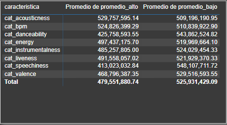

  ## **1.3 Pruebas de Significancia en Google Colab**  

  1. Plantear una hipótesis H0 y H1
     
  + Hipótesis nula: Las canciones con un mayor BPM (Beats Por Minuto) tienen más éxito en términos de streams en Spotify
  + Hipótesis Alternativa:
    
  3. Elegir nivel de confianza y por tanto el Alpha
     
  + 95% de confianza (0.95)
  + 5% Alpha (0.05)
     
  6. Elegir el estadístico de contraste adecuado a la prueba y calcular el P valor
     
  + P valor: aplicando la prueba, el valor que devuelve es el p valor.
    
  8. Comparar el P valor  con el Alpha y concluir si aceptamos o rechazamos la H0
     
  + Si el p valor es menor que el alpha se puede rechazar la hipótesis nula y aceptar la hipótesis alternativa
  + Si el p valor es mayor que el alpha no se puede rechazar la hipótesis nula.

  Diferencia entre los streams promedio de cada grupo (alto y bajo)
  
  > [!NOTE]
  > 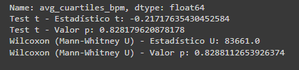
  
  Interpretación: 
    + Estadístico t y valor p: La prueba t nos dice que las medias de BPM en los grupos de canciones con muchos streams (alto) y pocos streams (bajo) son     prácticamente iguales. El valor p tan alto (0.966) nos dice que la diferencia es insignificante, es decir, no podemos decir con confianza que los BPM      difieren entre los dos grupos.
    + Estadístico U y valor p: La prueba de Mann-Whitney nos dice algo similar, pero en lugar de comparar solo las medias, compara las distribuciones         completas de BPM entre los dos grupos. El resultado 
      nos dice que las distribuciones de BPM en canciones con muchos streams y pocas streams también son prácticamente iguales. Nuevamente, el valor p        alto (0.966) nos dice que la diferencia no es 
      significativa.
   En resumen, según estos resultados, la cantidad de streams (si es alta o baja) no parece influir en el BPM de las canciones.

  Consulta: 
~~~
  // # Autenticación
  from google.colab import auth
  auth.authenticate_user()
  print('Authenticated')
  # Importación de librerías necesarias
  from google.cloud import bigquery
  import pandas as pd
  from scipy.stats import ttest_ind, mannwhitneyu
  # Definición del project_id
  project_id = 'proyectospotify-426316'
  client = bigquery.Client(project=project_id)
  # Definición del dataset
  dataset = 'dataset'
  table = 'dataset3'
  # Consulta SQL
  query = f"""
  SELECT *
  FROM {project_id}.{dataset}.{table}
  """
  # Ejecutar la consulta y convertir los resultados en un dataframe
  df = client.query(query).to_dataframe()
  # Mostrar las primeras filas del Dataframe
  print(df.head())
  # Transformar las columnas 'cat_streams' y 'cat_bpm' de string a numéricas
  stream_mapping = {'bajo': 1, 'alto': 4}
  bpm_mapping = {'bajo': 1,'alto': 4}
  
  
  df['cuartiles_streams'] = df['cat_streams'].map(stream_mapping)
  df['cuartiles_bpm'] = df['cat_bpm'].map(bpm_mapping)
  
  
  # Asegurarse de que no haya valores nulos en las columnas que se van a usar
  df = df.dropna(subset=['cuartiles_streams', 'cuartiles_bpm'])
  
  
  # Filtrar los grupos en función de los cuartiles
  grupo_alto_bpm = df[df['cuartiles_streams'] == 4]['cuartiles_bpm']
  grupo_bajo_bpm = df[df['cuartiles_streams'] == 1]['cuartiles_bpm']
  
  
  # Verificar el contenido de los grupos
  print(f'Número de tracks en el grupo alto BPM: {len(grupo_alto_bpm)}')
  print(f'Número de tracks en el grupo bajo BPM: {len(grupo_bajo_bpm)}')
  print(f'Grupo alto BPM:\n{grupo_alto_bpm.describe()}')
  print(f'Grupo bajo BPM:\n{grupo_bajo_bpm.describe()}')
  
  
  # Prueba t de Student
  stat_t, p_value_t = ttest_ind(grupo_alto_bpm, grupo_bajo_bpm, equal_var=False)
  
  
  print(f'Test t - Estadístico t: {stat_t}')
  print(f'Test t - Valor p: {p_value_t}')
  
  
  # Prueba U de Mann-Whitney
  stat_u, p_value_u = mannwhitneyu(grupo_alto_bpm, grupo_bajo_bpm, alternative='two-sided')
  
  
  print(f'Wilcoxon (Mann-Whitney U) - Estadístico U: {stat_u}')
  print(f'Wilcoxon (Mann-Whitney U) - Valor p: {p_value_u}')
~~~

  Diferencia entre las características (alto y bajo).
  
  > [!NOTE]
  > 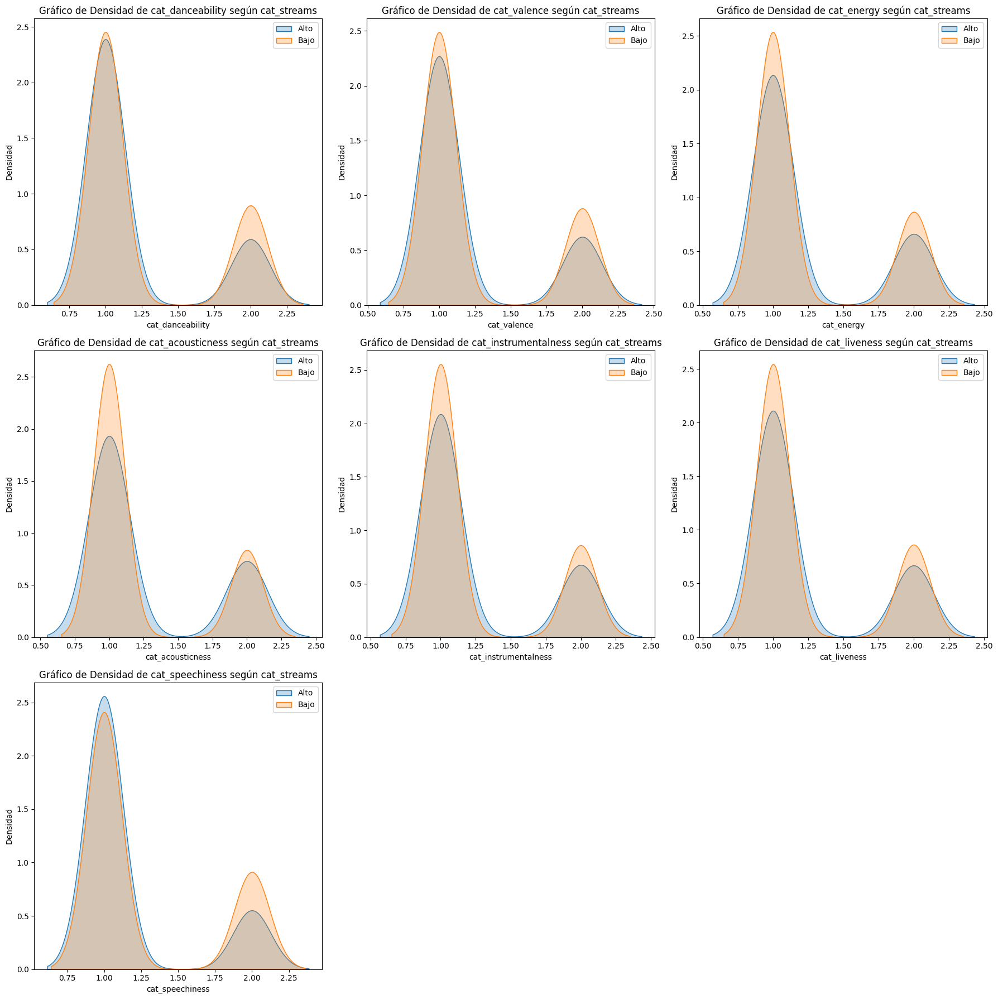
  
  Interpretación: 
  Las gráficas muestran comparaciones de densidad para diferentes categorías musicales, cada una con dos curvas que representan distintos niveles de actividad de streams. Las curvas azules y marrones       podrían indicar diferencias en la distribución de las métricas entre todos los streams y los más activos. Estas visualizaciones son útiles para analizar cómo varían estas características musicales en     relación con la actividad de streaming y pueden proporcionar información valiosa para estrategias de marketing y producción musical.

  Interpretación de las hipótesis
  
  > [!NOTE]
  > 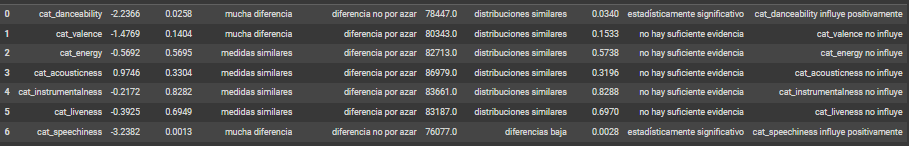
  
  Consulta: 
~~~
  //# Realizar Autenticación si es necesario
  from google.colab import auth
  auth.authenticate_user()
  print('Authenticated')
  
  # Importar librerías necesarias
  import pandas as pd
  import scipy.stats as stats
  from google.cloud import bigquery
  from statsmodels.formula.api import ols
  from scipy.stats import ttest_ind, mannwhitneyu
  import numpy as np
  
  # Inicializar el cliente de BigQuery
  project_id = 'proyecto-1-spotify'
  client = bigquery.Client(project=project_id)
  
  # Define tu proyecto, dataset y tabla aquí
  project_id = "proyecto-1-spotify"
  dataset = "Data_set"
  table = "Data_Set3"
  
  # Consulta SQL
  query = f"""
  SELECT *
  FROM {project_id}.{dataset}.{table}
  """
  
  # Ejecutar la consulta y convertir los resultados en un DataFrame
  df = client.query(query).to_dataframe()
  
  # Definir el nivel de confianza Alpha (6.2 Testes de significancia Caracteristicas 1.1)
  alpha = 0.05
  
  # Streams por categoría de cuartiles
  streams_alto_dance = df[df['cat_danceability'] == 'alto']['streams_limpio'].tolist()
  streams_bajo_dance = df[df['cat_danceability'] == 'bajo']['streams_limpio'].tolist()
  
  # Calcular promedios por categoría
  avg_streams_alto = np.mean(streams_alto_dance)
  avg_streams_bajo = np.mean(streams_bajo_dance)
  
  #Analizar por categoria
  #DANCEABILITY
  # Test T
  print("Resultados de Danceability")
  statistic_ttest, p_value_ttest = ttest_ind(streams_alto_dance, streams_bajo_dance, equal_var=False)
  print("Test T")
  print("Estadística T:", statistic_ttest)
  print("Valor p:", p_value_ttest)
  
  print("\n Resultado del Test T:")
  if p_value_ttest < alpha:
      print("Se rechaza la hipótesis nula: Existe una diferencia significativa entre las categorías 'alto' y 'bajo'")
  else:
      print("No se puede rechazar la hipótesis nula: No hay una diferencia significativa entre las categorías 'alto' y 'bajo'")
  print()
  # Test de Wilcoxon (Mann-Whitney U)
  statistic_mannwhitneyu, p_value_mannwhitneyu = mannwhitneyu(streams_alto_dance, streams_bajo_dance, alternative='two-sided')
  print("Test de Wilcoxon (Mann-Whitney U)")
  print("Estadística U:", statistic_mannwhitneyu)
  print("Valor p:", p_value_mannwhitneyu)
  print()
  
  print("\n Resultado Test Wilcoxon:")
  if p_value_ttest < alpha:
      print("Se rechaza la hipótesis nula: Existe una diferencia significativa entre las categorías 'alto' y 'bajo'")
  else:
      print("No se puede rechazar la hipótesis nula: No hay una diferencia significativa entre las categorías 'alto' y 'bajo'")
  
  #Interpretacion
  print("\nInterpretación del Test de Wilcoxon (Mann-Whitney U):")
  if p_value_mannwhitneyu < alpha:
      print("Se rechaza la hipótesis nula: Existe una diferencia significativa entre las categorías 'alto' y 'bajo'")
  else:
      print("No se puede rechazar la hipótesis nula: No hay una diferencia significativa entre las categorías 'alto' y 'bajo'")
~~~

  Consulta: (General todas las características)
~~~
  // #Importa las librerias necesarias (6.2 Testes de significancia caracteristicas completas)
  import pandas as pd
  import scipy.stats as stats
  from google.cloud import bigquery
  from scipy.stats import ttest_ind, mannwhitneyu
  import matplotlib.pyplot as plt
  import seaborn as sns
  import math
  
  #Configuracion del BigQuery
  project_id = 'proyecto-1-spotify'
  client = bigquery.Client(project=project_id)
  
  # Define tu proyecto, dataset y tabla aquí
  dataset = "Data_set"
  view = "Data_Set3"
  
  #Configuracion SQL
  query = f"""
  SELECT * FROM `{project_id}.{dataset}.{view}`
  """
  
  
  # Ejecutar la consulta y convertir los resultados en un DataFrame
  df = client.query(query).to_dataframe()
  
  #Imprimir los encabezados
  display(df.head())
  
  #Define cómo transformar las categorías 'alto' y 'bajo' en valores numéricos
  transform_map = {'alto': 2, 'bajo': 1}
  
  #Se aplica transformacion a las columnas categoricas especificadas
  categorical_columns = ['cat_streams', 'cat_danceability', 'cat_valence', 'cat_energy', 'cat_acousticness', 'cat_instrumentalness', 'cat_liveness', 'cat_speechiness']
  for column in categorical_columns:
      df[column] = df[column].map(transform_map)
  
  results = []
  
  characteristics = ['cat_danceability', 'cat_valence', 'cat_energy', 'cat_acousticness', 'cat_instrumentalness', 'cat_liveness', 'cat_speechiness']
  
  for characteristic in characteristics:
      if characteristic in df.columns:
          df_filtered = df.dropna(subset=['cat_streams', characteristic])
          
          grupo_alto = df_filtered[df_filtered['cat_streams'] == 2][characteristic]
          grupo_bajo = df_filtered[df_filtered['cat_streams'] == 1][characteristic]
          
          if grupo_alto.count() == 0 or grupo_bajo.count() == 0:
              print(f'Se omite {characteristic} debido a un grupo vacío.')
              continue
          
          stat_t, p_value_t = ttest_ind(grupo_alto, grupo_bajo, equal_var=False)
          stat_t = round(stat_t, 4)
          p_value_t = round(p_value_t, 4)
          
          stat_u, p_value_u = mannwhitneyu(grupo_alto, grupo_bajo, alternative='two-sided')
          stat_u = round(stat_u, 4)
          p_value_u = round(p_value_u, 4)
          
          if p_value_t < 0.05 or p_value_u < 0.05:
              influencia = f"{characteristic} influye positivamente"
          elif p_value_t > 0.05 and p_value_u > 0.05:
              influencia = f"{characteristic} no influye"
          else:
              influencia = f"{characteristic} influye negativamente"
          
          if abs(stat_t) < 1:
              interpretacion_stat = "medidas similares"
          else:
              interpretacion_stat = "mucha diferencia"
  
          if p_value_t < 0.05:
              interpretacion_p_value_t = "diferencia no por azar"
          else:
              interpretacion_p_value_t = "diferencia por azar"
  
          if stat_u > len(grupo_alto) * len(grupo_bajo) / 2 + 1.96 * (len(grupo_alto) * len(grupo_bajo) * (len(grupo_alto) + len(grupo_bajo) + 1) / 12)**0.5:
              interpretacion_u_stat = "diferencias alta"
          elif stat_u < len(grupo_alto) * len(grupo_bajo) / 2 - 1.96 * (len(grupo_alto) * len(grupo_bajo) * (len(grupo_alto) + len(grupo_bajo) + 1) / 12)**0.5:
              interpretacion_u_stat = "diferencias baja"
          else:
              interpretacion_u_stat = "distribuciones similares"
  
          if p_value_u < 0.05:
              interpretacion_p_value_u = "estadísticamente significativo"
          else:
              interpretacion_p_value_u = "no hay suficiente evidencia"
  
          results.append({
              'caracteristica': characteristic,
              't_stat': stat_t,
              't_p_value': p_value_t,
              'interpretacion_stat': interpretacion_stat,
              'interpretacion_p_value_t': interpretacion_p_value_t,
              'u_stat': stat_u,
              'interpretacion_u_stat': interpretacion_u_stat,
              'u_p_value': p_value_u,
              'interpretacion_p_value_u': interpretacion_p_value_u,
              'resultado': influencia
          })
  
  num_cols = 3
  num_rows = math.ceil(len(results) / num_cols)
  
  fig, axs = plt.subplots(num_rows, num_cols, figsize=(18, 6 * num_rows))
  
  for idx, row in enumerate(results):
      ax = axs[idx // num_cols, idx % num_cols]
      sns.kdeplot(df[df['cat_streams'] == 2][row['caracteristica']], fill=True, label='Alto', ax=ax)
      sns.kdeplot(df[df['cat_streams'] == 1][row['caracteristica']], fill=True, label='Bajo', ax=ax)
      ax.set_title(f'Gráfico de Densidad de {row["caracteristica"]} según cat_streams')
      ax.set_xlabel(row["caracteristica"])
      ax.set_ylabel('Densidad')
      ax.legend()
  
  for i in range(len(results), num_rows * num_cols):
      fig.delaxes(axs.flatten()[i])
  
  plt.tight_layout()
  plt.show()
  
  results_df = pd.DataFrame(results)
  pd.options.display.max_colwidth = None
  display(results_df[['caracteristica', 't_stat', 't_p_value', 'interpretacion_stat', 'interpretacion_p_value_t', 'u_stat', 'interpretacion_u_stat', 'u_p_value', 'interpretacion_p_value_u', 'resultado']])
  
  # Crear un mapeo de valores numéricos a nombres
  cat_danceability_map = {2: 'alto', 1: 'bajo'}
  print()
  
  #(6.3 Tabla resumen agrupada por la variable categórica)
  # Tabla resumen de estadísticas
  resumen_danceability = df[df['cat_danceability'].isin([2, 1])].groupby('cat_danceability').agg({
      'streams_limpio': ['mean', 'count', 'median', 'std', 'min', 'max'],
      'danceability_%': ['mean', 'count', 'median', 'std', 'min', 'max'],
      'valence_%': ['mean', 'count', 'median', 'std', 'min', 'max'],
      'energy_%': ['mean', 'count', 'median', 'std', 'min', 'max'],
      'acousticness_%': ['mean', 'count', 'median', 'std', 'min', 'max'],
      'instrumentalness_%': ['mean', 'count', 'median', 'std', 'min', 'max'],
      'liveness_%': ['mean', 'count', 'median', 'std', 'min', 'max'],
      'speechiness_%': ['mean', 'count', 'median', 'std', 'min', 'max']
  })
  
  # Renombrar el índice de la agrupación
  resumen_danceability.rename(index=cat_danceability_map, inplace=True)
  
  # Transponer la tabla para mostrar de manera adecuada
  resumen_danceability = resumen_danceability.T
  
  # Mostrar el resumen
  display(resumen_danceability)
~~~

  Características musicales en base a las medidas de tendencia central de Streams
  
  > [!NOTE]
  > 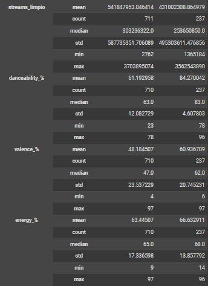
  
  > [!NOTE]
  > 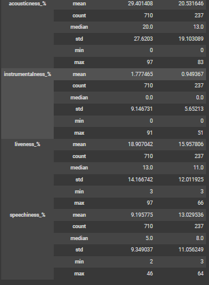
  
  Interpretación:  
  Presenta estadísticas descriptivas de diferentes características musicales como tempo, energía, danceability, loudness, valence y acousticness. Para cada característica, se muestran la cantidad, media,   mediana y desviación estándar basadas en los datos de streams. Estos datos son útiles para analizar patrones en el comportamiento y preferencias de streaming musical.
  
  + Tiempo: Velocidad o ritmo de la música.
  + Energía: Intensidad y actividad percibida.
  + Danceability: Facilidad con la que se puede bailar al ritmo de la música.
  + Loudness: Volumen general de la música.
  + Valence: Positividad transmitida por la música.
  + Acousticness: Nível de acústica o sonidos no amplificados.
    
  La tabla ayuda a comprender cómo estas características influyen en la cantidad de streams que recibe una canción.

  Regresión lineal

  Donde:
  Y = aX + b
  Y es la variable dependiente.
  X es la variable independiente.
  a es la pendiente de la línea representa cómo cambia Y en función de X.
  b es la intersección en el eje Y cuando X es igual a cero.

  Streams por BPM

  > [!NOTE]
  > 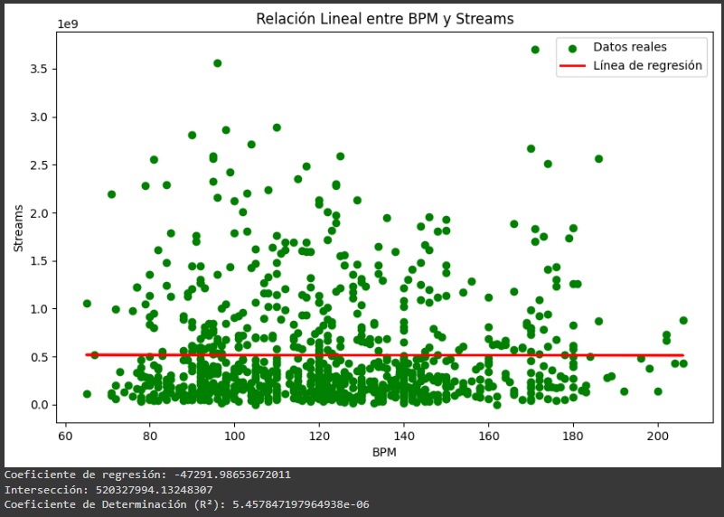

  Interpretación: 
  Datos reales (puntos azules):
  1. Los puntos azules representan los datos reales. Cada punto en el gráfico corresponde a una observación en tu conjunto de datos.
  2. En el eje horizontal (X) se encuentran los valores de BPM (beats per minute o pulsaciones por minuto).
  3. En el eje vertical (Y) se encuentran los valores de "streams".
  Línea de regresión (línea roja):
  L1. a línea roja es la línea de regresión lineal que mejor ajusta los datos.
  2. La línea es casi horizontal, lo que indica una pendiente muy baja o prácticamente nula.
  Relación entre BPM y streams:
  1. Este gráfico muestra que no hay una relación lineal significativa entre BPM y streams.
  2. La dispersión de los puntos alrededor de la línea horizontal sugiere que los BPM no tienen un impacto notable en el número de streams.
  Interpretación general:
  Los BPM de una canción no parecen tener una relación lineal significativa con el número de streams que recibe.
  Los streams parecen estar distribuidos de manera bastante uniforme a través de diferentes BPM, lo que sugiere que otros factores distintos de los BPM influyen más en el número de streams.

  Consulta: 
~~~
#Hito 3 Regresion lineal bpm y streams (7.2)
import pandas as pd
import numpy as np
import matplotlib.pyplot as plt
from sklearn.linear_model import LinearRegression

# Verificar que las columnas 'bpm' y 'streams' existen en el DataFrame
if 'bpm' in df.columns and 'streams_limpio' in df.columns:
    # Limpiar los datos, eliminando filas con valores nulos en 'bpm' o 'streams'
    df_clean = df[['bpm', 'streams_limpio']].dropna()
    # Extraer las variables independientes (X) y dependientes (y)
    X = df_clean[['bpm']].values
    y = df_clean['streams_limpio'].values
    # Crear y entrenar el modelo de regresión lineal
    model = LinearRegression()
    model.fit(X, y)
    # Calcular la predicción de 'streams' en función de 'bpm'
    y_pred = model.predict(X)
    # Visualización de los resultados
    plt.figure(figsize=(10, 6))
    plt.scatter(X, y, color='green', label='Datos reales')
    plt.plot(X, y_pred, color='red', linewidth=2, label='Línea de regresión')
    plt.xlabel('BPM')
    plt.ylabel('Streams')
    plt.title('Relación Lineal entre BPM y Streams')
    plt.legend()
    plt.show()
    # Mostrar los coeficientes de la regresión
    print(f'Coeficiente de regresión: {model.coef_[0]}')
    print(f'Intersección: {model.intercept_}')
else:
    print("Las columnas 'bpm' y 'streams' no se encuentran en el DataFrame.")
~~~

  Streams por Total de playlist
  
  > [!NOTE]
  > 

  Interpretación: 
  La gráfica muestra una relación positiva entre el total de playlists y los streams. Los puntos azules representan los datos reales y se observa una tendencia: a medida que aumenta el número de            playlists, también lo hacen los streams. La línea roja indica la línea de regresión, confirmando esta correlación positiva. Esto sugiere que tener más playlists puede ayudar a incrementar los streams     de tus canciones o contenido.
  
  Consulta: 
~~~
import pandas as pd
import numpy as np
import matplotlib.pyplot as plt
from sklearn.linear_model import LinearRegression

# Verificar que las columnas 'total_playlist' y 'streams' existen en el DataFrame
if 'bpm' in df.columns and 'streams_limpio' in df.columns:
    # Limpiar los datos, eliminando filas con valores nulos en 'total_playlist' o 'streams'
    df_clean = df[['total_playlist', 'streams_limpio']].dropna()
    # Extraer las variables independientes (X) y dependientes (y)
    X = df_clean[['total_playlist']].values
    y = df_clean['streams_limpio'].values
    # Crear y entrenar el modelo de regresión lineal
    model = LinearRegression()
    model.fit(X, y)
    # Calcular la predicción de 'streams' en función de 'total_playlist'
    y_pred = model.predict(X)
    # Visualización de los resultados
    plt.figure(figsize=(10, 6))
    plt.scatter(X, y, color='blue', label='Datos reales')
    plt.plot(X, y_pred, color='red', linewidth=2, label='Línea de regresión')
    plt.xlabel('total playlist')
    plt.ylabel('Streams')
    plt.title('Relación Lineal entre Total playlist y Streams')
    plt.legend()
    plt.show()
    # Mostrar los coeficientes de la regresión
    print(f'Coeficiente de regresión: {model.coef_[0]}')
    print(f'Intersección: {model.intercept_}')
else:
    print("Las columnas 'total_playlist' y 'streams' no se encuentran en el DataFrame.")
~~~

  Streams por BPM en año 2020
  
  > [!NOTE]
  > 

  Interpretación: 
  Muestra un análisis de dispersión con puntos azules que representan los datos reales de BPM (latidos por minuto) de canciones y su número de streams durante el año 2020. La línea roja horizontal cerca    del límite inferior del eje vertical representa la línea de regresión, sugiriendo un intento de encontrar una relación lineal entre BPM y streams.
  + Los valores proporcionados en la esquina inferior izquierda:
  + Coeficiente de regresión: 394481.8377897972
  + Intersección: -61991958.55329528
  Estos valores representan el coeficiente de regresión y la intersección con el eje Y para la línea de regresión, respectivamente. Aunque la línea de regresión parece estar cerca del límite inferior,      estos valores indican que hay una relación positiva entre el BPM de las canciones y el número de streams que reciben. Es decir, canciones con un BPM más alto podrían tener una tendencia a obtener más     streams, aunque esta relación no parece ser muy fuerte dado el posicionamiento de la línea de regresión.

  Consulta: 
~~~
// Código:
import matplotlib.pyplot as plt
from sklearn.linear_model import LinearRegression

# Filtrar las canciones con año de lanzamiento igual a 2020
df_2020 = df[df['released_year'] == 2020]

# Verificar la existencia de las columnas 'bpm' y 'streams_limpio' en el DataFrame
if 'bpm' in df_2020.columns and 'streams_limpio' in df_2020.columns:
    # Limpiar los datos, eliminando filas con valores nulos en 'bpm' o 'streams_limpio'
    df_clean = df_2020[['bpm', 'streams_limpio']].dropna()
    # Extraer las variables independientes (X) y dependientes (y)
    X = df_clean[['bpm']].values
    y = df_clean['streams_limpio'].values.reshape(-1, 1)  # Asegurar que y sea un array 2D
    # Crear y entrenar el modelo de regresión lineal
    model = LinearRegression()
    model.fit(X, y)
    # Calcular la predicción de 'streams' en función de 'bpm'
    y_pred = model.predict(X)
    # Visualización de los resultados
    plt.figure(figsize=(10, 6))
    plt.scatter(X, y, color='blue', label='Datos reales')
    plt.plot(X, y_pred, color='red', linewidth=2, label='Línea de regresión')
    plt.xlabel('BPM')
    plt.ylabel('Streams')
    plt.title('Relación Lineal entre BPM y Streams (Año 2020)')
    plt.legend()
    plt.show()
    # Mostrar los coeficientes de la regresión
    print(f'Coeficiente de regresión: {model.coef_[0][0]}')
    print(f'Intersección: {model.intercept_[0]}')
else:
    print("Las columnas 'bpm' y 'streams_limpio' no se encuentran en el DataFrame.")
~~~
    
## **Validación de hipótesis**

  Hipótesis 1
  Las canciones con un mayor BPM (Beats Por Minuto) tienen más éxito en términos de streams en Spotify.

  Hipótesis 2
  Las canciones más populares en el ranking de Spotify también tienen un comportamiento similar en otras plataformas como Deezer
  
  Hipótesis 3
  La presencia de una canción en un mayor número de playlists se relaciona con un mayor número de streams.
  
  Hipótesis 4
  Los artistas con un mayor número de canciones en Spotify tienen más streams.
  
  Hipótesis 5
  Las características de la canción influyen en el éxito en términos de streams en Spotify.

## **Resultados**

  **Hipótesis 1**

  > [!NOTE]
  > 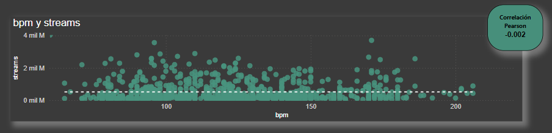
  > 

  Se refuta hipótesis: No hay una relación lineal significativa entre BPM y streams, por lo que se determina que estas variables no influyen directamente en el éxito de una canción.
  
  **Hipótesis 2**
  
   > [!NOTE]
   > 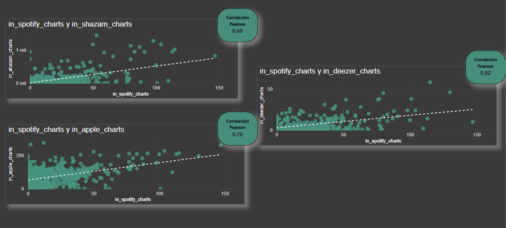
  
  Se valida hipótesis: El estudio demuestra que existe una correlación positiva entre las variables, por lo que se determina qué las canciones que son más populares en Spotify tienen a tener el mismo       comportamiento en otras plataformas como Deezer y Apple Music.
  
  **Hipótesis 3**

  > [!NOTE]
  > 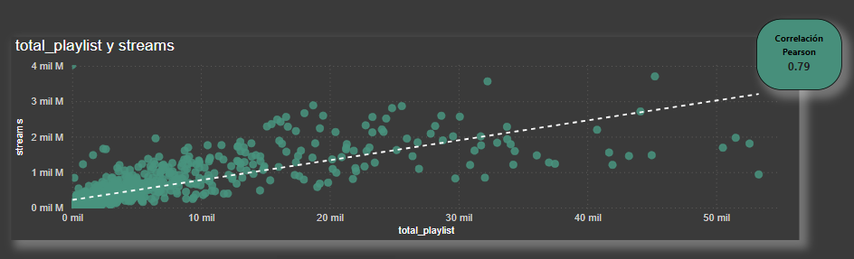
  > 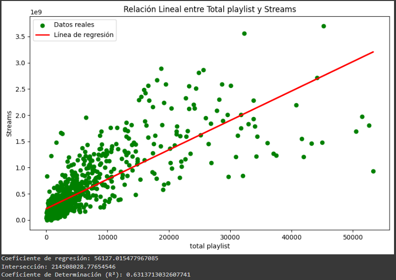

  Se valida hipótesis: El estudio demuestra que existe  una relación positiva entre el total de playlists y los streams. , por lo que se determina que tener más playlists puede ayudar a incrementar los     streams de las canciones.
  
  **Hipótesis 4**

  > [!NOTE]
  > 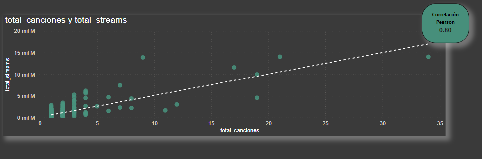

  Se valida hipótesis: El estudio demuestra que existe  una relación positiva entre las variables. , por lo que se determina que la productividad de un       artista en términos de cantidad de canciones puede estar relacionada con su popularidad o éxito medido por el número de streams.

  **Hipótesis 5**
   Esta hipótesis fue estudiada de dos formas:

   +Correlación de Perason: (Individual por caracteristica)

  > [!NOTE]
  > 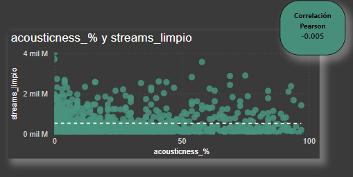

  Interpretación: El coeficiente de correlación cercano a cero implica que no hay una relación lineal significativa entre estas dos variables.

  > [!NOTE]
  > 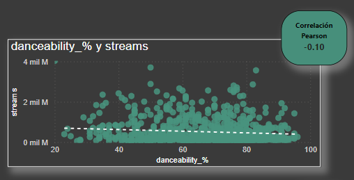

  Interpretación: Se analiza si la capacidad de baile de una canción afecta su popularidad en términos de streams, aunque el coeficiente de        correlación sugiere que no hay una relación lineal significativa entre estas dos variables.

  > [!NOTE]
  > 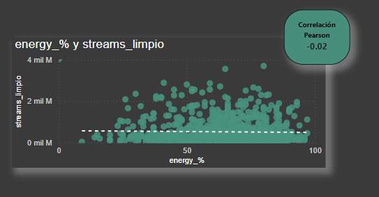

  Interpretación: El coeficiente de correlación sugiere que no hay una relación lineal significativa entre estas dos variables.

 > [!NOTE]
 > 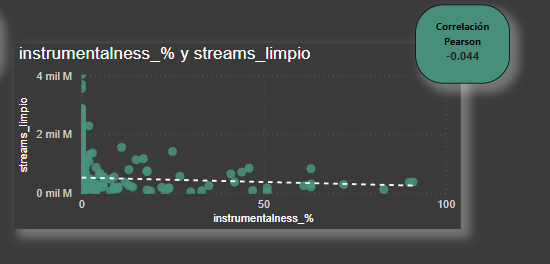

 Interpretación: El coeficiente de correlación sugiere que no hay una relación lineal significativa entre estas dos variables.

  > [!NOTE]
  > 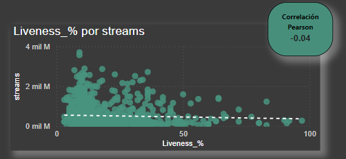

 Interpretación: El coeficiente de correlación Pearson de -0.04, sugiere que no hay una relación lineal significativa entre la vivacidad y la 
 popularidad de las canciones en términos de streams.

  > [!NOTE]
  > 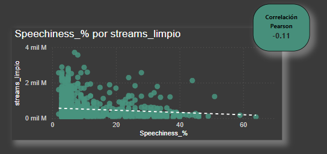

 Interpretación: El coeficiente de correlación sugiere que existe una relación debil entre estas dos variables.

  > [!NOTE]
  > 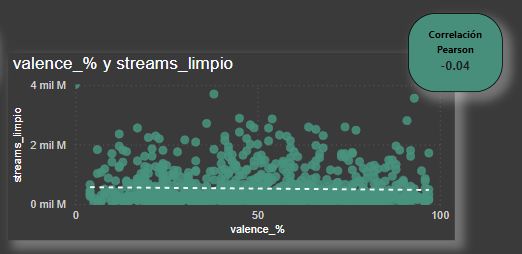
 
  Interpretación: El coeficiente de correlación sugiere que no hay una relación lineal significativa entre estas dos variables.

  + Pruebas Estadísticas

  Para evaluar nuestras hipótesis, seleccionamos un nivel de confianza del 95% (α = 0.05). Utilizamos dos pruebas estadísticas según la distribución de nuestros datos:

  * Prueba t de Student: Para comparar la diferencia de medias entre dos grupos con distribución normal.
  * Prueba U de Mann-Whitney: Para comparar dos grupos cuando no se cumple la suposición de normalidad.
  
  > [!NOTE]
  > 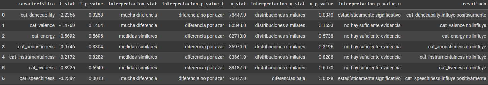
  
   Se refuta hipótesis: Las características generales de una canción no influyen directamente en el éxito de la canción, las únicas que podrian tener una influencia débil son Danceability y Speechiness.

## **Conclusiones**

El éxito de una canción esta relacionado con:

1. La presencia de la canción en multiples playlist.
2. Artistas con mayor repertorio y variedad de canciónes.
3. Disponibiliada de la canción en diferentes plataformas de manera simultanea.
4. Que la canción sea bailable y con presencia de palabras (aunque estas no influyan de manera relevante).
   
 ## **Recomendaciones**

**+ Presencia en Listas de Reproducción:** Aparecer en diversas listas de reproducción y rankings musicales aumenta la visibilidad de la canción y facilita que llegue a un público más amplio. Esto puede lograrse mediante la colaboración con curadores de listas y utilizando estrategias de marketing digital.

**+  Colaboración con Artistas Reconocidos:** Trabajar con artistas que tienen un amplio repertorio y reconocimiento puede atraer a sus seguidores existentes y añadir credibilidad a la nueva canción. Las colaboraciones pueden crear sinergias y abrir nuevas oportunidades para el crecimiento de la audiencia.

**+ Disponibilidad en Múltiples Plataformas:** Asegurar que la canción esté disponible en varias plataformas de streaming (como Spotify, Apple Music, Deezer, etc.) maximiza su accesibilidad y alcance. Esto permite a los oyentes encontrar y escuchar la canción en su plataforma preferida, lo que puede aumentar el número total de reproducciones y el impacto general de la canción.
  
  
## Recursos
## Presentación del Proyecto 
Accede a la presentación del proyecto [aquí](https://drive.google.com/file/d/1BlpEM_YZgUQvM5y882vqlx-kVCrwcvJs/view?usp=sharing)

## Google Colab Notebook
Accede a mi notebook en Google Colab haciendo clic [aquí](https://colab.research.google.com/drive/1wF92L0CWGlRsGqt7QbAt8QBEa42lU-w2).

## Dashboard 
Accede al PDF de mi dashboard de Power BI haciendo clic [aquí](https://drive.google.com/file/d/1z9lX56PImNskBTMjBCvlK6Fwe3HHzKXH/view?usp=sharing).

  

